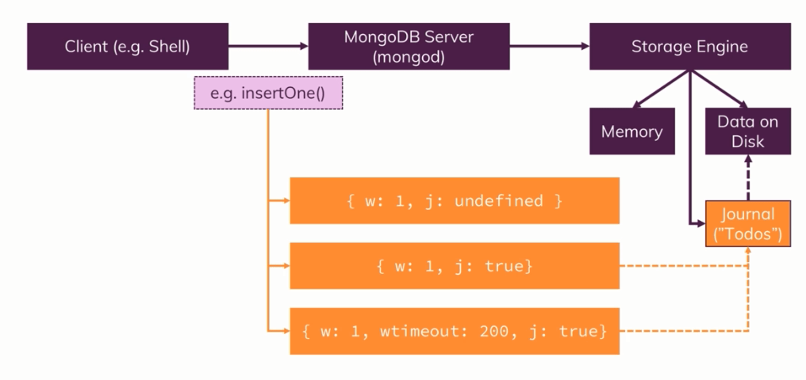
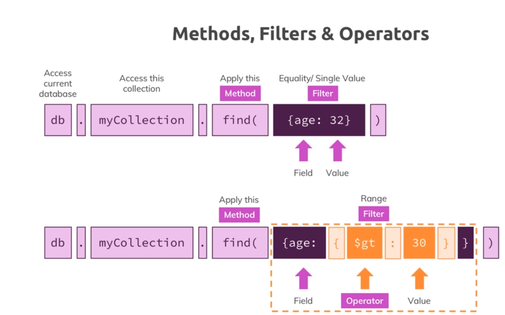
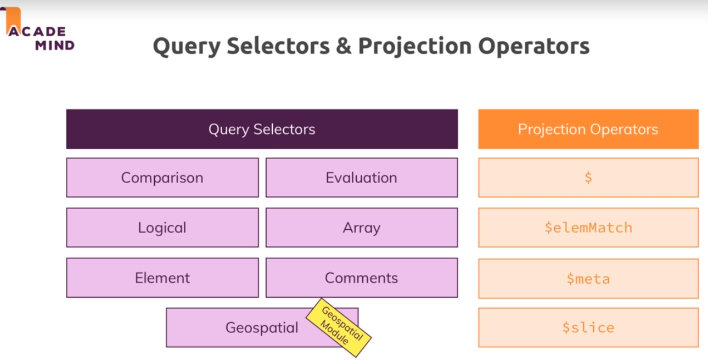

# Summary of udemy course by [Maximilian Schwarzmüller](https://www.udemy.com/course/mongodb-the-complete-developers-guide/#instructor-2)

## MongoDB Storage Engine - Wired Tiger


--- 

## MongoDB shell commands -

- `show dbs`
- `use shop` - creates databse if it doesn't already exists
- `db.products.insertOne({name: "A book", price: 10})` - creates collection if it doesn't already exists
- `db.products.find()` - retrieves first 20 documents inside "products" collection. Doesn't returns all the documents. Instead returns a cursor when documents are more than 20. Cursor - Type "it" for more.
- `db.products.updateOne({price: 10}, {$set: {description: "good read"}})` -  _$set_ is required here. Without _$set_ error will be thrown.
- `db.products.updateMany({}, {$set: {description: "good read"}})` - _$set_ is required here. Without _$set_ error will be thrown.
- `db.products.insertMany([{name: "A shirt", price: 20}, {name: "A bag", price: 30}])` - Array of json documents. Mongodb maintains the _order_ here.
- `db.products.deleteMany({})` - Delete all documents in the collection.
- `db.products.find({price: {$gt: 10}})` - Find documents whose price is greater than 10.
- `db.products.findOne({price: {$gt: 10}})`
- `db.products.find().toArray()` - Mongodb returns first 20 documents when plain find query is executed. _toArray()_ forces find() to fetch all documents and will not stop at first 20 documents. Not optimal if there are a lot of documents.
- `db.products.find().forEach((item) => {printjson(item)})`
- `db.products.find({}, {name: 1, _id: 0})` - returns only name field from the documents. This is called _Projection_. Data transformation happens on the Mongodb server before it is transferred to client.
- `db.products.findOne({price: 20}).size` - Outputs size field of element after fetching document from mongodb.
- `db.products.findOne({size: "M"})` - Querying size Array - Outputs the document which has size equals "M". Mongodb is smart enough to return the document even if an array field is queried, i.e even if size field is an array it returns the document.
- `db.products.find({"status.description": "on-time"})` - Querying nested Documents/Objects - returns the document that match the nested query. Dot notation allows to look into Embedded documents.
- `db.dropDatabase` - Deletes the current database.
- `db.collectionName.drop()` - Deletes the collection by name "collectionName".
- `typeof db.products.findOne({price: 30}).name` - returns Data type of the value

Collection is equivalent to tables in structured DB.  
Cursor doesn't exists for insert, update and delete methods.  
Embedded documents - Document inside Document. Can have upto 100 level of nesting. Arrays can also be present in nested documents.  
Use filters and operators to limit the number of documents retrieved.  
Filters allow you to restrict the amount of documents and Projection then allows to restrict fields per document.  

---

## Schemas and Relations - 
- `One to One - Embedded document` - Used when there is a strong relationship. 
- `One to One - Using References` - Used when there is not a strong relationship.
- `One to Many - Embedded document` - Ex. Post/Comments relationship
- `One to Many - Using References` - Ex. City/Citizens relationship
- `Many to Many - Embedded document` - Ex. Customers/Orders relationship. Many to Many relationship is modelled often using References.
- `Many to Many - Using References` - Ex. Books/Author relationship. 

_$lookup_ allows you to fetch two related documents and merge them in one document in one step instead of two steps. This mitigates some of the disadvantages of splitting documents across collections because now you can merge them in one go. This should not be used always since this is performance intensive operation.  
Schema Validation - Validates if values inserted/updated meet the schema criteria.

### Deciding Factors - 
- How do you fetch your data?
- How often do you change it and if you change it do you need to change it everywhere?
- Is duplicating data fine?
- If we need latest data all the time(Ex. age of the person should be current age), use References to establish relationship.

---

## Create Operations - 

- `Ordered Inserts` - Every element that is inserted is processed standalone, but if one fails it cancels the entire insert operation, but it doesn't rollback the elements it already inserted. To override this default MongoDB behaviour, we can pass `{ordered: false}` in the insert operation as second parameter.
```js
db.hobbies.insertMany([{_id: "sports", name: "Sports"}, {_id: "cooking", name: "Cooking"}, {_id: "cars", name: "Cars"}])
db.hobbies.find()
db.hobbies.insertMany([{_id: "yoga", name: "Yoga"}, {_id: "cooking", name: "Cooking"}, {_id: "hiking", name: "Hiking"}])
db.hobbies.find()
db.hobbies.insertMany([{_id: "yoga", name: "Yoga"}, {_id: "cooking", name: "Cooking"}, {_id: "hiking", name: "Hiking"}], {ordered: false})
db.hobbies.find()
```
Command will fail while executing second insert. This is default behaviour of MongoDB which is called Ordered Inserts.  
By setting `{ordered: false}` we can change the default behaviour. Though it still throws an error but it also inserts the last element.
- `writeConcern` -   
  
```js
db.persons.insertOne({name: "Chrissy", age: 41}, {writeConcern: {w: 0}})
db.persons.insertOne({name: "Michael", age: 51}, {writeConcern: {w: 1, j: true}})
db.persons.insertOne({name: "Aliya", age: 22}, {writeConcern: {w: 1, j: true, wtimeout: 1}})
```
Storage Engine is responsible for writing data in disk and also managing data in memory.  
Write operation first ends up in memory but it is also scheduled to be written on disk.  
We can configure a writeConcern for all write operations.  
j stands for journal which is an additional file that Storage Engine manages which is like a todo file. The journal can be kept to save operations that a Storage Engine needs to do that have not been completed yet, like the write. The idea of the journal file which is a real file on disk is that if the server goes down for any reason that file is still there. So that when the server restarts it can look into that file and see what it needs to do. Writing into databse files is more heavy than writing in journal. Enabling the journal configuration will result in writes taking longer.

- `Atomicity` - MongoDB CRUD operations are atomic on the Document Level.

- `Importing Data` - json files can be imported in MongoDB with _mongoimport_ command.

---

## Read Operations - 

- `Methods, Filters & Operators` -  
 

- `Types of Operators` - 
    - Query and Projection (Query Selectors, Projection Operators)
    - Update (Fields, Arrays)
    - Aggregation (Pipeline Stages, Pipeline Operators)

### Query Selectors and Projection Operators    
  

- `find()` and `findOne()` uses equality to filter the results.
- Comparison Operators - 
    - `db.movies.find({runtime: {$eq: 60}})` - Equivalent to _find()_ and _findOne()_
    - `db.movies.find({runtime: {$ne: 60}})` - Not Equal Operator
    - `db.movies.find({runtime: {$lt: 40}})` - Lower than Operator
    - `db.movies.find({runtime: {$lte: 40}})` - Lower than equal Operator
    - `db.movies.find({runtime: {$gt: 40}})` - Greater than Operator
    - `db.movies.find({runtime: {$gte: 40}})` - Greater than equal Operator
    - `db.movies.find({runtime: {$in: [30, 42]}})` - Find all movies that have runtime equal to [30, 42].
    - `db.movies.find({runtime: {$nin: [30, 42]}})` - Find all movies that don't have runtime of [30, 42].

- Querying Embedded Fields and Arrays - 
    - `db.moview.find({"rating.average": {$gt: 7}})` - Query an Object
    - `db.moview.find({genres: "Drama"})` - Query an Array. genres is an array.
    - `db.moview.find({genres: [Drama]})` - Exact equality to an Array. genres array has only one value. genres: ["Drama"].

- Logical Operators - 
    - `db.movies.find({$or: [{"rating.average": {$lt: 5}}, {"rating.average": {$gt: 9.3}}]})` - Finds all documents that have rating lower than 5 OR greater than 9.3. MongoDB will check multiple conditions in array.
    - `db.movies.find({$nor: [{"rating.average": {$lt: 5}}, {"rating.average": {$gt: 9.3}}]})`
    - `db.movies.find({$and: [{"rating.average": {$gt: 9}}, {"genres": "Drama"}]})` - _$and_ takes array of conditions as input.
    - `db.movies.find({"rating.average": {$gt: 9}}, {"genres": "Drama"})` - This is equivalent to using _$and_ as the default behavior of _find()_ is to concatenate all conditions.
    - `db.movies.find({"genres": "Horror"}, {"genres": "Drama"})` - Will not return correct result in JS, as same object key is encountered twice. In this case second "genres" will override first one. So results returned will contain movies with "genres" Drama only.
    - `db.movies.find({$and: [{"genres": "Horror"}, {"genres": "Drama"}]})` - Will work perfectly fine as now we are using _$and_. If you look for values on same field, you need to use _$and_.
    - `db.movies.find({runtime: {$not: {$eq: 60}}})` - Return movies where runtime is not equal to 60.
    - `db.movies.find({runtime: {$ne: 60}})` - Return movies where runtime is not equal to 60. Same as above.

- Element Operators - 
    - `db.users.find({age: {$exists: true}})`
    - `db.users.find({age: {$exists: true, $gte: 30}})`
    - `db.users.find({age: {$exists: true, $ne: null}})` - "Age" field exists and the value is not null. 
    - `db.users.find({phone: {$type: "number"}})`
    - `db.users.find({phone: {$type: ["double", "string"]}})`


---

## References
- [MongoDB Documentation](https://www.mongodb.com/docs/)
- [MongoDB Drivers](https://www.mongodb.com/docs/drivers/)
- [MongoDB official Nodejs driver](https://www.npmjs.com/package/mongodb)
- [MongoDB Shell](https://www.mongodb.com/docs/mongodb-shell/)
- [MongoDB Shell Methods](https://www.mongodb.com/docs/mongodb-shell/reference/methods/)
- [MongoDB Data Types](https://www.mongodb.com/docs/manual/reference/bson-types/)
- [MongoDB Operators](https://www.mongodb.com/docs/manual/reference/operator/query/)
- [MongoDB - The Complete Developer's Guide](https://documentation.peelmicro.info/databases/mongodb-mongodb-the-complete-developers-guide.html)