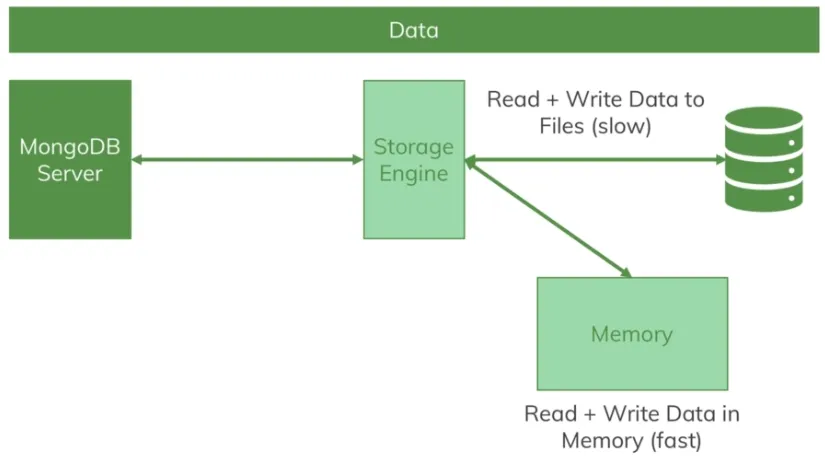

# Summary of udemy course by [Maximilian Schwarzmüller](https://www.udemy.com/course/mongodb-the-complete-developers-guide/#instructor-2)

## Mongodb Storage Engine - Wired Tiger

## Mongodb shell commands - 

- show dbs
- use shop - creates databse if it doesn't already exists
- db.products.insertOne({name: "A book", price: 10}) - creates collection if it doesn't already exists
- db.products.find() - retrieves all documents inside collection products
- db.products.updateOne({price: 10}, {$set: {description:"good read"}}) -  $set is required here
- db.products.updateMany({}, {$set: {description:"good read"}})
- db.products.insertMany([{name: "A shirt", price: 20}, {name: "A bag", price: 30}]) - Array of json documents. Mongodb maintains the order here.

Collection is equivalent to tables in structured DB.